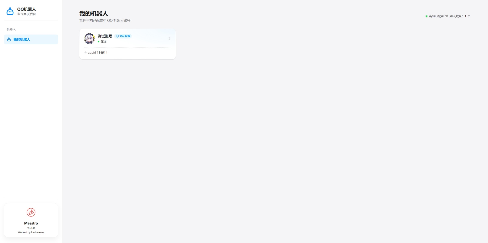
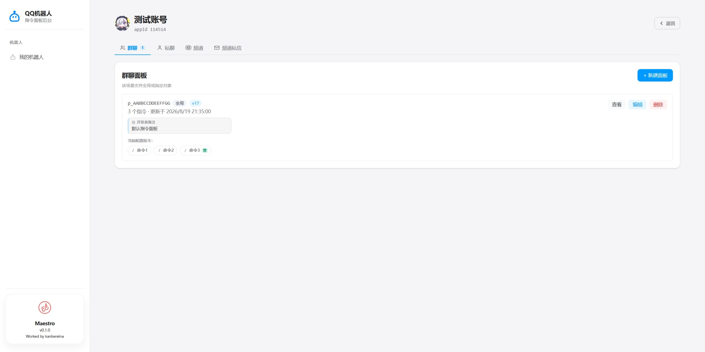

<div align="center">


# Maestro

**QQ 官方机器人指令面板可视化管理工具**

随 NoneBot 启动一个本地 WebUI，在浏览器里查看和编辑 QQ 机器人的指令面板。

</div>

## 目录

- [简介](#简介)
- [界面预览](#界面预览)
- [安装](#安装)
- [配置](#配置)
- [使用](#使用)
- [注意事项](#注意事项)
- [开发](#开发)
- [许可](#许可)

## 简介

QQ 官方机器人的指令面板（用户在聊天输入框旁看到的命令菜单）目前只能通过 [OpenAPI](https://bot.q.qq.com/wiki/develop/api-v2/server-inter/menu-panel/) 管理，官方没有提供可视化界面。Maestro 是一个 NoneBot 插件，随 bot 启动后在本地提供一个网页版的管理界面：

- 按 `QQ_BOTS` 配置列出所有机器人，每个机器人一张卡片
- 群聊、私聊、频道、频道私信四种场景分开管理，标签页上显示各自的面板数量
- 指令项支持增删改和拖拽排序
- 提交前先在本地校验：显示宽度、`https` 链接、数量上限
- QQ 返回的业务错误会转成明确的提示，而不是一句 `500 Internal Server Error`

## 界面预览

<p align="center">
  
  <br>
  <sub>机器人列表</sub>
</p>

<p align="center">
  
  <br>
  <sub>面板编辑</sub>
</p>

## 安装

<details open>
<summary>nb-cli</summary>

```bash
nb plugin install nonebot-plugin-maestro
```

</details>

<details>
<summary>包管理器</summary>

```bash
uv add nonebot-plugin-maestro
# 或
pip install nonebot-plugin-maestro
```

然后把插件加进 `pyproject.toml` 的 `[tool.nonebot]`：

```toml
plugins = ["nonebot_plugin_maestro"]
```

</details>

## 配置

以下配置写在 bot 项目的 `.env` 文件里。全部有默认值，不配置也能直接使用。

| 配置项 | 默认值 | 说明 |
|---|---|---|
| `MAESTRO_HOST` | `127.0.0.1` | WebUI 监听地址 |
| `MAESTRO_PORT` | `8100` | WebUI 监听端口 |
| `MAESTRO_ENABLED` | `true` | 是否启用 WebUI |
| `MAESTRO_TOKEN` | 空（不启用） | 访问令牌。设置后所有 `/api/*` 请求都要携带 `X-Maestro-Token` 请求头；WebUI 会弹窗引导输入，也可以在网址后加 `?token=...` 传入 |

WebUI 使用独立的 uvicorn 服务，端口与 NoneBot 的 `PORT` 互不影响。默认选 8100，就是为了避开 NoneBot 常用的 8080。

适配器要求 driver 提供 HTTP 客户端，需要在 `.env` 里这样配置：

```dotenv
DRIVER=~httpx+~websockets
```

> [!NOTE]
> WebUI 自带三层防护：绑定本机地址时启用 Host 白名单（防 DNS rebinding）、校验 Origin 与 Host 一致（防跨站请求，`no-cors` POST 也能拦截）、可选的 `MAESTRO_TOKEN` 令牌鉴权。

> [!WARNING]
> 把 `MAESTRO_HOST` 改成 `0.0.0.0` 等非本机地址对外部署时，必须同时设置 `MAESTRO_TOKEN`，否则 WebUI 不会启动。这种部署方式下 Host 白名单不生效，令牌是唯一的访问控制。

## 使用

启动 bot 后用浏览器打开 <http://127.0.0.1:8100>。机器人要等 WebSocket 连接成功后才会出现在列表里。

> [!CAUTION]
> 面板保存在 QQ 服务端，跟随机器人账号，不是本地文件。删除和覆盖立即对所有用户生效，且无法撤销。

## 注意事项

**字段长度按显示宽度计算，不是字符数。** QQ 服务端统计长度时非 ASCII 字符按 2 计：`name` 上限 14，`desc` 上限 30。

宽度超限时服务端返回 `code=30013`「超出数量限制」——这个错误码同时用于真正的数量超限，光看报错很容易误判。WebUI 会实时显示当前宽度，并在提交前拦下超限内容。

**写接口（创建 / 修改 / 删除）限频 10 QPM**，每个机器人最多 20 个面板（跨场景合计）。连续保存触发限频时会收到 429 提示，稍等片刻再试即可。

## 开发

```bash
uv sync              # 安装依赖
uv run poe test      # 测试（含覆盖率）
uv run poe lint      # ruff 检查
uv run poe typecheck # pyrefly 类型检查
uv run python bot.py # 启动本地 bot 调试
```

前端资源在 `src/nonebot_plugin_maestro/static/`（`index.html` / `app.css` / `app.js`），不内嵌在 Python 代码里。

欢迎参与贡献，流程见 [CONTRIBUTING.md](CONTRIBUTING.md)。面板接口的实测细节与架构决策记录在 [docs/](docs/README.md)。

## 许可

[MIT](LICENSE)
